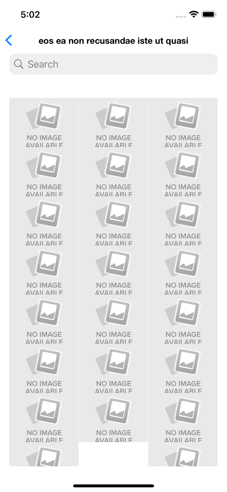

# Bosta iOS Task  

## 📌 Overview  
Bosta iOS Task is a native iOS application developed using **Swift** and **UIKit**. It follows the **MVVM architecture** and integrates with external APIs using **Moya** and **RxSwift**. The app consists of:  
- A **Profile Screen** displaying user information and a list of albums.  
- An **Album Details Screen** showing a searchable grid of photos.  

## 🚀 Features  
✔ Fetch and display user profile information.  
✔ List user albums and navigate to album details.  
✔ Search functionality in the album details screen.  
✔ MVVM architecture with **RxSwift** for reactive programming.  
✔ **Moya** for efficient API handling.  
✔ Swift Package Manager for dependency management.  

## 🛠 Tech Stack  
- **Swift**  
- **UIKit**  
- **MVVM**  
- **RxSwift**  
- **Moya**  
- **Swift Package Manager (SPM)**  

## 📡 API Integration  
The app fetches data from:  
- **User Info & Albums API**: `https://jsonplaceholder.typicode.com/users/1/albums`  
- **Album Photos API**: `https://jsonplaceholder.typicode.com/albums/{albumId}/photos`  

### 🏗 Architecture  
The project follows the **MVVM (Model-View-ViewModel)** pattern:  
- **Model:** Defines data structures.  
- **View:** Handles UI components.  
- **ViewModel:** Manages business logic and API interactions with RxSwift.  

### 📷 Screenshots  
### Profile Screen  

### Album Details Screen  

### Photo Screen  

